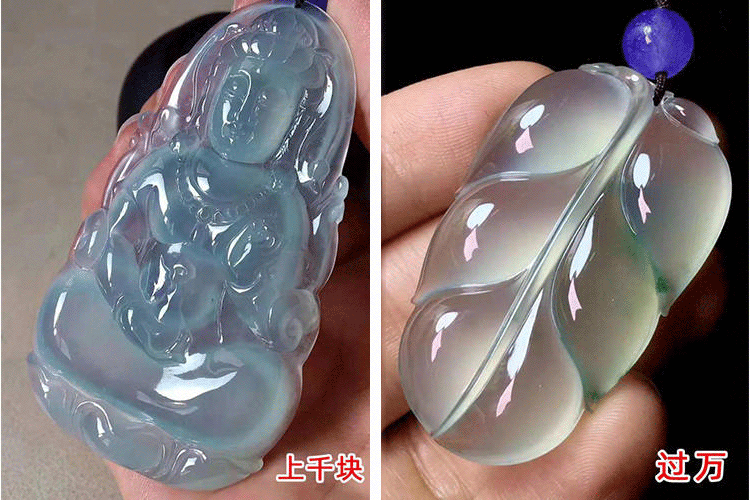

# 【精】翡翠实用干货分享
这可能是关于翡翠玉石的最诚恳、最有技术含量、最接地气、最实用的一篇文章，从我的从业过程讲到了具体怎么看价。

我是一个从事翡翠行业十几年的人，有的只是祖上从业几十年的家族资源。我的父亲在采矿一线亲自挑选翡翠原石毛料至今已有二十余年，而我负责为这些宝贵的“石头”进行设计加工，让它焕发不一样的光彩。时至今日，我父亲仍然坚持亲赴缅甸挑石头、开料，常年往返于中缅边境。我有的不是噱头，仅是一点经验，翠友们通过此文可以对比下有没有买贵，没有买过的权当看一个有趣的行业故事，让你了解这个所谓的暴利、水深的行业，是否真的如此。

从业十几年，每天能收到不同人发给我类似下面这张图的问价信息，还有的就是如何辨别翡翠真假以及影响翡翠价值因素有哪些，文章后面也会有讲解，请详细耐心看到最后。只要你花十分钟看完必定有所收获，少走弯路少吃亏。 对翡翠感兴趣的朋友可以加我微信： `18224487974 (长按复制)`

凌晨3点，正是大多数人熟睡十分，但身在我处，却是嘈杂胜白天。这里大多数人赚着月入几千的钱，怀着月入几万的期望，做着月入几十万的发财梦，是的，我说的就是翡翠。

从业十几年，以下是我概括的，大多数人对翡翠的认识，你是不是也有同感？

1. 翡翠和玉的区别，傻傻分不清楚。
2. 买之前首先会先怀疑一下是不是假的。
3. 找熟人买翡翠，才能买到便宜的。
4. 认为价位1000多的还算可以了，5000到10000算高档的了，戴出去有面子。
5. 买了翡翠总喜欢找人估价，如果找熟人买的总爱找人看是不是A货。
6. 心里价位承受的是2000左右的，看上的总是2万左右的。
7. 认为翡翠是中老年戴的。
8. 高价买回去，带出去也不会有人看出来，不如买个大金链子划算。
对翡翠感兴趣的朋友可以加我微信： `18224487974 (长按复制)`

我第一次到了云南瑞丽珠宝市场，可以用大开眼界来形容，随便一串用红线栓着的手镯差不多就是3-5万一只了，好吧，我上一次看见这种捆成一堆卖的是袜子。

印象里商场的玉手镯都是各种镁光灯打着，在柜台里面犹如皇太后般伺候，而这里十几万、甚至几十万的翡翠，怎么就这么随便乱放，是真的值那么多钱吗？我当时跟所有外行一样，心想要么是假的，要么漫天要价。后来我慢慢了解到，翡翠这行业，货不在多，好货才能带来财富，只有眼力好，特别勤奋的货主，才能几十年都不被市场淘汰。 喜欢翡翠的朋友可以加我微信： `18224487974 (长按复制)`

我大学主修的是珠宝鉴别与设计，毕业后选择回家继承父亲是珠宝事业，每日与“石头”为伴。刚开始，父亲天天领我到市场看货，这过程就好比高中学化学，书读了，实验课上了，化学反应看到了，真要做一个肥皂出来，还是要经过很长一段时间的磨练。

这里科普一下：什么是玉？化学解释就不说了，玉的概念很广泛，其中包括翡翠、和田玉、黄龙玉、昆仑玉、玉髓、水沫玉等等，而翡翠就是人们最常称呼的玉。引用东汉时期的一句话就是：“石之美者皆为玉！”翡翠作为玉中之王，其价值便宜的下至几十块钱，贵的上亿都有。

说到翡翠价格，就不得不提到玉石文化了。翡翠在中国数千年的文化历史长河中有举足轻重的地位，特别是清朝时期最为盛行，由于宫廷玉器得不到满足，于是有人进贡缅甸玉器进京，由于缅甸翡翠质量上乘，便逐渐成为皇室玉器象征，也被很多达官显贵收藏或作为传家宝传承，民间还有传言：“乱世藏金，盛世藏玉”。翡翠代表的是对美的追求，代表的是身份地位的象征；不论是赋予它寓意、还是文化，都凝结着人们对它深深的感情。翡翠也是人们最常谈起、最多人收藏、被专家及富豪们认定为最有价值的天然玉石。 对翡翠发展历史文化感兴趣的朋友可以加我微信： `18224487974 (长按复制)`

接下来讲一讲所谓的翡翠一手货源是怎么回事。每个商家都会说自己是一手货源，其实中国人没有资格去缅甸矿场挖矿，所以只能从缅甸人手里购买翡翠原石毛料。其中很大一部分在缅甸直接交易给其他缅商，顶级料子的直接通过渠道卖给中国大老板，一般是通过公盘的形式，当然价钱绝对不会低。翡翠是缅甸人的国宝，为了最大化矿产收入，是不可能顾及什么老朋友新朋友情谊的，狮子大开口是常事。

首先买料子的大多是大公司或者一些零散的加工师傅，他们根据自己的行业经验给出价格买回来，要么继续把石头转卖别人，别人卖别人，永不打开的在循环，只有少数自己打开自己加工，这又涉及到涨亏问题了，这里不详细介绍了，又是长篇大论。 对翡翠切石感兴趣的朋友可以加我微信： `18224487974 (长按复制)`

现在，你是否还认为一手货源，是你想的一手货源？这还只是毛料，成品出来以后，根据雕工、卖相划分为三六九等，成品之间也存在行家买卖，买来再卖，中间可能转了一两手，也可能四五手，这其中有中国商人，也有缅甸商人，再后来到了柜面上零售，或者由网络平台销售。

说到这里朋友们肯定会有疑问，我买的这些玉得有多贵！多么不划算！但是你想，一杯牛奶到消费者手中，也需要从养奶牛开始，到规模化生产，物流运输配送等。我认为它值这个价，才会有这次交易，不管中间多少次加价，最后流通到市面上便是一线市场的合理价，售价高于产品价值本身必然不会被人所接受，特别是现在网络发达的今天，翡翠的销售价格也越来越透明化。

按照我的经验，越是外行越喜欢乱还价，几万的翡翠能给你出300，气的人直翻白眼！不还价，高了自己划不来，低了人家不想理你，遇到脾气暴躁的就是一顿臭骂。 想了解怎么看翡翠价值的朋友可以加我微信: `18224487974 (长按复制)`

从回家继承父亲产业开始，我就决心想打破翡翠暴利的行业现象，从原石开料到成品，都是自家加工完成。父亲跟舅舅常常往返中国和缅甸之间，只为从源头把关，保证质量的同时把价格压到最低。而我负责毛料的设计与加工。为了让料子价值最大化，每一块料子都要画很多张稿做对比，研究好料子的纹路和颜色分布才能确定加工方案。

无论你在哪里，通过何种渠道买得了何种商品，实际上买家只是和你相同的欣赏水平和愿意出的价位，商家考虑的是市场价，买家考虑的是是否真的喜欢和是否愿意相信你，这么多年我积攒的客人几乎都是这样，我们品味相同，他们对我足够信任。 喜欢翡翠的朋友可以加我微信： `18224487974 (长按复制)`

翡翠没有行业戒尺，卖掉是钱，卖不掉就只能当宝！翡翠的交易机制让每个小商贩都有存货，眼光好的存得少，眼光差的几年都卖不出。我们家做了几十年翡翠生意，父亲从一个小商贩慢慢积累，为了节省开支都是穿最便宜的衣服，骑着电动车风吹日晒，每天开张赚一两百，我跟着父母，累了就趴在柜台睡。直到现在，还有很多珠宝商是过着这样的生活。

父亲老实肯干，几十年也积累了许多客户，现在我们生活水平有了提高，虽然现在每天都很忙，但是没有了从前的辛酸。 不论是翡翠吊坠、手镯、戒指、项链还是摆件，我们都在经营，还可以私人订制。喜欢翡翠的朋友可以加我微信： `18224487974 (长按复制)`

缅甸是现在世界上唯一一个还没有统一的国家，也是一个非常神秘的国度，宗教信仰、战争总能上世界闻。 想看缅甸风土人情，以及我如何进行翡翠设计加工的的朋友可以加我微信： `18224487974 (长按复制)`

关于如何分辨翡翠好坏，都有行业界定标准，信得过我的朋友，可以发清晰的照片或者视频发给我，我帮你鉴别跟估价都是没问题的。翡翠定价因素多，同样品质有没有裂纹、棉絮、棉坑价格相差很多，颜色阳一点、暗一点、翠一点、蓝一点、灰一点，都有价格差异，绝大多数人并非在一线购买，很多旅游购物、商场选购、网络购买等等，地域差异、售卖方式决定价格，所以建议你多筛选一些靠谱的商家，然后多对比，看的多了，也能知三分。

商场里、旅游景点的翡翠，很多都是偏贵的。很多人花好几万买的翡翠，拿来给我看，我们也就卖一万左右，中间的利润是转了好几手的，几万可以买更好的成色跟水种，你说这钱花得冤不冤，这也就是大家为什么在商场看到的翡翠一般都很普通，但是又老贵的原因。有些人会说，我买的是服务、是高档，这类客户就当我没说，首饰嘛，自己喜欢认为值得就好。但相信很多人还是想以同样的价钱买更高档的东西，我家是做一手货源的，款式也是独家设计。 看到这篇文章就是咱们的缘分，不妨加我微信： `18224487974 (长按复制)` 微信里有个一手货源的翡翠商，翡翠方面日后若有需要可以随时找我！网海茫茫，下次就不一定能相遇了。

翡翠是最会长的石头，就是因为种水色都不一样，且具有历史传承，所以才被市场筛选成了最具有价值的石头，好比明星一样，想红，除了有人包装之外，还必须你自己要有独特的魅力，比如长得美、有内涵才行。

翡翠根据种水基本分为马牙种、豆种、糯种、糯冰种、冰种、高冰种、冰玻种、玻璃种，还有罕见的龙石种等。 想交流学习翡翠经验心得可以加我微信: `18224487974 (长按复制)`

下面这三个手镯，都是水润清透且有底色，都好看，但是最下面的相对来说内部棉理结构多了一点，中间的跟上面的一块料下来，都是冰春彩，不过中间的光泽程度不及上面的，所以价格从上到下就是两万左右、一万左右、几千。

如果这三个都没有颜色，呈白底色，价格减半；若灰底色，暗绿色，价格再减行话看价先看色；无色就看种，无种无色不值钱，下面就是价格两三百的手镯，当然质地算是细腻，有陶瓷鳞片结构很干的更不值钱，十块钱的都有。然而很多人花两三千买的手镯，也就是这个质地，卖家美其名曰我这个是真的，网上是假的。说实话，智能时代，大家都不傻，每个人都有自己的渠道。 喜欢翡翠的朋友可以加我微信： `18224487974 (长按复制)`

下面说下看色，俗话说色差一分，价差十倍，说的就是翡翠，颜色当中阳绿、帝王绿最值钱，简单说就是越是妖艳越是贵，淡绿、苹果绿、蓝绿、菠菜绿、通常都不贵，普通人即可拥有。

下面是价值价格比较高的戒面图片，是不是不一样，正如一首歌唱的，说不清你哪里好，就是没有人替代得了。

说了这么多，例如还有如何判定翡翠真假？如何界定种水？裂纹对于翡翠价值影响？缅甸手镯抛光粉是怎么回事？。。等等，就不再继续说了，写完可能要几万字，书可以出一本了。 想交流学习翡翠知识可以加我微信： `18224487974 (长按复制)` 总之就是大家找到靠谱商家多看多关注,对于喜欢的人，无休止喜欢；若是不喜欢，它就是石头而已。

现在网络信息发达，翡翠也随着很多中国女士佩戴而被更多人喜爱与追求。众所周知，任何行业都有造假的存在，何况翡翠这种天然原矿石，价格高低不一，不懂的真的很难预估它的价值。购买翡翠还是要要从源头开始才是较有保障的，其实买翡翠，不一定高价就是好，找对渠道，找对供货商，可以省去一大笔冤枉钱，还能买到货真价实的翡翠。以下是我设计加工的一些产品，一手货源。 您要是喜欢翡翠可以加我微信： `18224487974 (长按复制)`

三十出头的我，在翡翠行业奉献了整个青春，也无法找其他工作，但是我耿直正直，善良心软，诚实可靠，我同大多数人一样，在找寻明天。

经常有翠友说就是每天看看我朋友圈里的产品介绍，也是一种享受。不买没关系，就当多加个朋友。如果你有任何关于翡翠方面需要或帮助，我也会耐心帮你解答。不管是吊坠、手镯、戒指、项链还是摆件，我们都在经营，也非常的希望能和全国喜欢翡翠的朋友一起交流、学习更多的翡翠知识。

**我能够以第一手的价格拿到翡翠原矿石，再结合宝石的特点，设计、打磨到成品，所有流程都是我们自己加工设计的，我每天都会在朋友圈发一些不同款式的翡翠饰品、摆件。 欢迎喜欢翡翠的朋友们添加我微信： 18224487974 (长按复制)**
